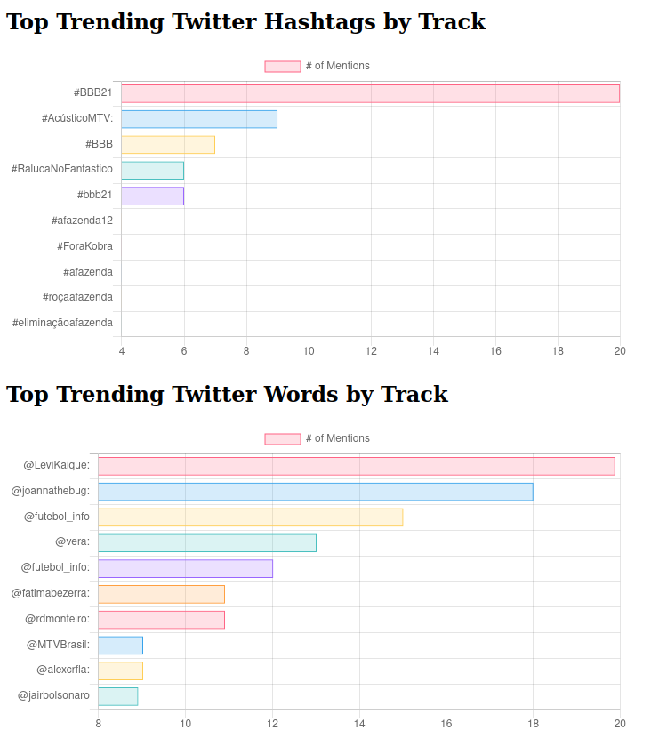

# Twitter Trending # and @ Analytics

Este repositório consiste no deploy e exemplo de uma aplicação _Spark Streaming_ para coleta
de Hashtags (#) e Contas (@) mais comentadas no Twitter em tempo real.



* Requisitos
    1. Criar conta na [API do Twitter](https://developer.twitter.com/) 
    2. Criar um Cluster com [Hadoop](https://hadoop.apache.org/) (HDFS + Yarn) com o [Spark](https://spark.apache.org/)
    3. Certificar que em todos os nós do cluster há [Docker](https://www.docker.com/) instalado


## Tutorial

1. Em todos os nós do cluster, executar:
```shell
sh build.sh
```
Isso irá construir as imagens dos DashBoards e da aplicação do Twitter. 
Antes de construir as imagens, certifique as *variáveis de ambiente* nos arquivos _Dockerfile_


2. No nó mestre da aplicação, executar:
```shell
sh start.sh
```
Para construir a imagem do Twitter, é necessário um arquivo `.env` com as seguintes configurações:
```shell
ACCESS_TOKEN=<access_token>
ACCESS_SECRET=<access_secret>
CONSUMER_KEY=<consumer_key>
CONSUMER_SECRET=<consumer_secret>
BEARER=<bearer>
```

## Links legais sobre Spark Streaming:
[Near Real Time Recommendations](https://databricks.com/session/near-real-time-netflix-recommendations-using-apache-spark-streaming) 

[Spark Streaming na Netflix](https://sparkhub.databricks.com/video/spark-and-spark-streaming-at-netflix/)

## Dúvidas?
### Escreva uma Issue, mande um PR ;)